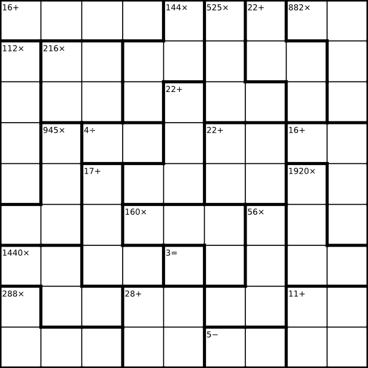

# MathDoku (KenKen)

How to compile and run your code from the command line:

If you are running Java 11 or later, you will need to download the JavaFX libraries separately. 
Now to compile the application, simply type:

<b> javac --module-path=(path to javaFX folder)/javafx-sdk-11.0.2/lib --add-modules=ALL-MODULE-PATH Main.java </b>

Then you can run the application using:

<b> java --module-path=(path to javaFX folder)/javafx-sdk-11.0.2/lib --add-modules=ALL-MODULE-PATH Main </b>

# Rules of the Game
A player needs to fill the cells in an NxN square grid with the numbers 1 to N (one number per cell), while adhering to the following constraints:
 - Each number must appear exactly once in each row.
 - Each number must appear exactly once in each column.
 
 Furthermore, there are groups of adjacent cells called cages, which are highlighted on the grid by thicker boundaries. Within each cage is a label showing a           
   target number followed by an arithmetic operator (+, -, x, ÷). There is an additional constraint associated with these cages:
   
 - It must be possible to obtain the target by applying the arithmetic operator to the numbers in that cage. For - and ÷, this can be done in any order.
 
Note: If a cage consists of a single cell, then no arithmetic operator is shown. The label simply shows the number that must be in that cell.

# Example Grid

# The End Product

# Coursework Instructions

<object data="Instructions.pdf" type="application/pdf" width="700px" height="700px">
    <embed src="Instructions.pdf">
        
This browser does not support PDFs. Please download the PDF to view it: <a href="Instructions.pdf">Download PDF</a>.

    </embed>
</object>

